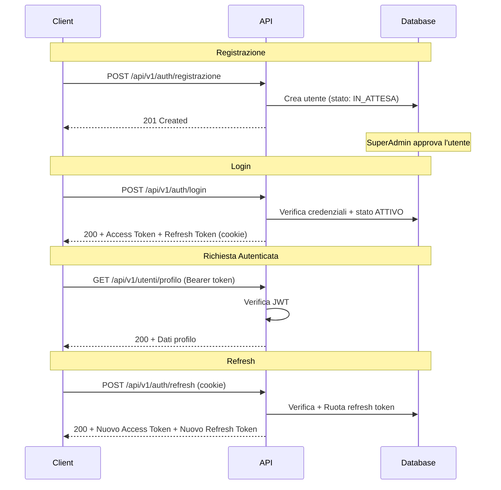

# GymMaster — Modulo Autenticazione

## Panoramica
Sistema di autenticazione basato su **JWT** (JSON Web Token) con refresh token rotation e hashing password **Argon2id**.

## Flusso di Autenticazione

## Endpoint

| Metodo | Percorso | Auth | Rate Limit | Descrizione |
|--------|----------|------|------------|-------------|
| POST | `/api/v1/auth/registrazione` | ❌ | 5/15min | Registra nuovo utente |
| POST | `/api/v1/auth/login` | ❌ | 5/15min | Login → Access + Refresh |
| POST | `/api/v1/auth/refresh` | 🍪 | 5/15min | Rinnova access token |
| POST | `/api/v1/auth/logout` | 🍪 | 5/15min | Revoca refresh token |

## Sicurezza

- **Password:** Hash con Argon2id (64MB RAM, 3 iterazioni, 4 thread paralleli)
- **Access Token:** JWT con scadenza 15 minuti, contiene: utenteId, email, ruolo
- **Refresh Token:** Token opaco (40 bytes hex), salvato in DB, scadenza 7 giorni
- **Refresh Token Rotation:** Ad ogni refresh il vecchio token viene revocato e ne viene creato uno nuovo
- **Rilevamento Furto:** Se un refresh token revocato viene riutilizzato, tutti i token dell'utente vengono invalidati
- **Cookie:** Refresh token impostato come `httpOnly`, `secure` (in produzione), `sameSite: strict`
