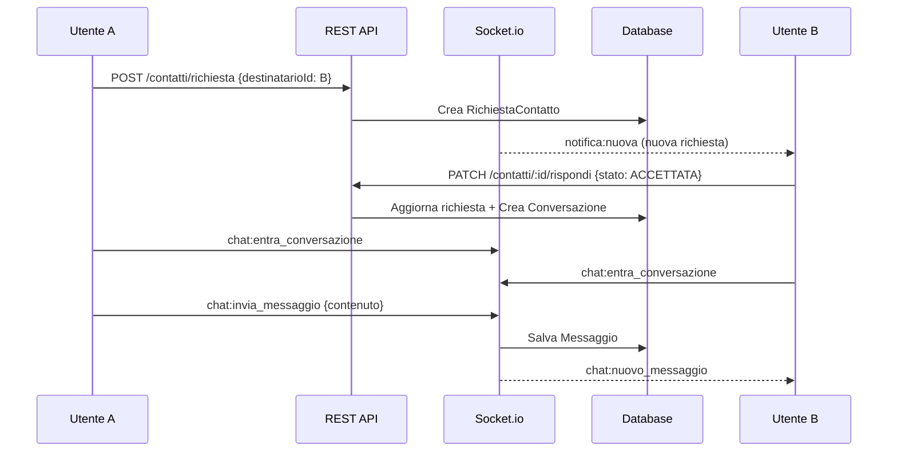

# GymMaster — Modulo Chat

## Panoramica
Sistema di messaggistica real-time basato su **Socket.io** con sistema di richieste di contatto per la privacy. Supporta chat tra utenti e con personal trainer.

## Privacy & Sicurezza
- **Richiesta obbligatoria:** Nessun utente può inviare messaggi senza che il destinatario abbia accettato la richiesta di contatto
- **Blocco utente:** Possibilità di bloccare un utente (stato `BLOCCATA`)
- **Retention configurabile:** Ogni utente sceglie per quanti giorni conservare i messaggi (default: 7 giorni, 0 = permanente)
- **Pulizia automatica:** Job ogni 6 ore elimina i messaggi scaduti

## Flusso

## Endpoint REST

| Metodo | Percorso | Descrizione |
|--------|----------|-------------|
| POST | `/api/v1/chat/contatti/richiesta` | Invia richiesta di contatto |
| PATCH | `/api/v1/chat/contatti/:id/rispondi` | Rispondi (accetta/rifiuta/blocca) |
| GET | `/api/v1/chat/contatti/ricevute` | Richieste in attesa |
| GET | `/api/v1/chat/conversazioni` | Lista conversazioni |
| GET | `/api/v1/chat/conversazioni/:id/messaggi` | Messaggi (paginati) |

## Eventi Socket.io

| Evento | Direzione | Descrizione |
|--------|-----------|-------------|
| `chat:entra_conversazione` | Client → Server | Entra nella room di una conversazione |
| `chat:esci_conversazione` | Client → Server | Esci dalla room |
| `chat:invia_messaggio` | Client → Server | Invia messaggio (con callback) |
| `chat:nuovo_messaggio` | Server → Client | Nuovo messaggio ricevuto |
| `chat:sta_scrivendo` | Bidirezionale | Indicatore di digitazione |
| `chat:smesso_scrivere` | Bidirezionale | Fine digitazione |
| `notifica:nuova` | Server → Client | Notifica push |
