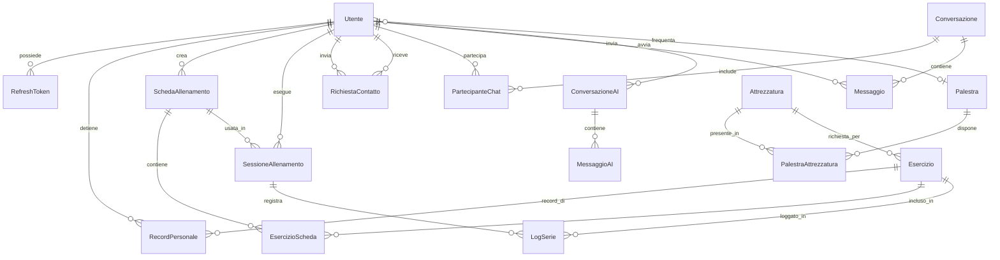

# GymMaster — Schema Database

## Diagramma ER

## Tabelle

### `utenti`
| Campo | Tipo | Vincoli | Descrizione |
|-------|------|---------|-------------|
| id | SERIAL | PK | ID auto-incrementale |
| email | VARCHAR | UNIQUE, NOT NULL | Email dell'utente |
| password_hash | VARCHAR | NOT NULL | Hash Argon2id della password |
| nome | VARCHAR | NOT NULL | Nome visualizzato |
| ruolo | ENUM | DEFAULT 'UTENTE' | UTENTE, PERSONAL_TRAINER, SUPERADMIN |
| palestra_id | INT | FK nullable | Palestra di riferimento |
| stato | ENUM | DEFAULT 'IN_ATTESA' | IN_ATTESA, ATTIVO, BANNATO |
| punti_esperienza | INT | DEFAULT 0 | Punti gamification |
| chat_retention_giorni | INT | DEFAULT 7 | Giorni conservazione messaggi (0=permanente) |
| data_registrazione | TIMESTAMP | DEFAULT now() | Data di registrazione |

### `palestre`
| Campo | Tipo | Vincoli | Descrizione |
|-------|------|---------|-------------|
| id | SERIAL | PK | ID auto-incrementale |
| nome_catena | VARCHAR | NOT NULL | Nome della catena (es. Virgin Active) |
| citta | VARCHAR | NOT NULL | Città della sede |
| indirizzo | VARCHAR | NOT NULL | Indirizzo |
| nazione | VARCHAR | DEFAULT 'Italia' | Nazione |

### `attrezzature`
| Campo | Tipo | Vincoli | Descrizione |
|-------|------|---------|-------------|
| id | SERIAL | PK | ID auto-incrementale |
| nome | VARCHAR | NOT NULL | Nome attrezzatura |
| categoria | ENUM | NOT NULL | CARDIO, PESI_LIBERI, MACCHINE, CAVI, FUNZIONALE |
| muscoli_bersaglio | VARCHAR | nullable | Muscoli principali target |

### `esercizi`
| Campo | Tipo | Vincoli | Descrizione |
|-------|------|---------|-------------|
| id | SERIAL | PK | ID auto-incrementale |
| nome | VARCHAR | NOT NULL | Nome esercizio |
| gruppo_muscolare_primario | VARCHAR | NOT NULL | Muscolo principale |
| gruppo_muscolare_secondario | VARCHAR | nullable | Muscolo secondario |
| attrezzatura_richiesta_id | INT | FK nullable | Attrezzatura necessaria |
| descrizione | TEXT | nullable | Descrizione e tecnica |
| link_video | VARCHAR | nullable | URL video dimostrativo |

### `richieste_contatto`
| Campo | Tipo | Vincoli | Descrizione |
|-------|------|---------|-------------|
| id | SERIAL | PK | ID auto-incrementale |
| mittente_id | INT | FK, NOT NULL | Utente che invia la richiesta |
| destinatario_id | INT | FK, NOT NULL | Utente che riceve |
| stato | ENUM | DEFAULT 'IN_ATTESA' | IN_ATTESA, ACCETTATA, RIFIUTATA, BLOCCATA |
| data_richiesta | TIMESTAMP | DEFAULT now() | Data invio |
| data_risposta | TIMESTAMP | nullable | Data risposta |

### Enumerazioni
- **Ruolo:** `UTENTE`, `PERSONAL_TRAINER`, `SUPERADMIN`
- **StatoUtente:** `IN_ATTESA`, `ATTIVO`, `BANNATO`
- **CategoriaAttrezzatura:** `CARDIO`, `PESI_LIBERI`, `MACCHINE`, `CAVI`, `FUNZIONALE`
- **Livello:** `BASE`, `INTERMEDIO`, `AVANZATO`
- **Visibilita:** `GLOBALE`, `PERSONALE`
- **StatoRichiesta:** `IN_ATTESA`, `ACCETTATA`, `RIFIUTATA`, `BLOCCATA`
- **TipoChat:** `PRIVATA`, `PERSONAL_TRAINER`
